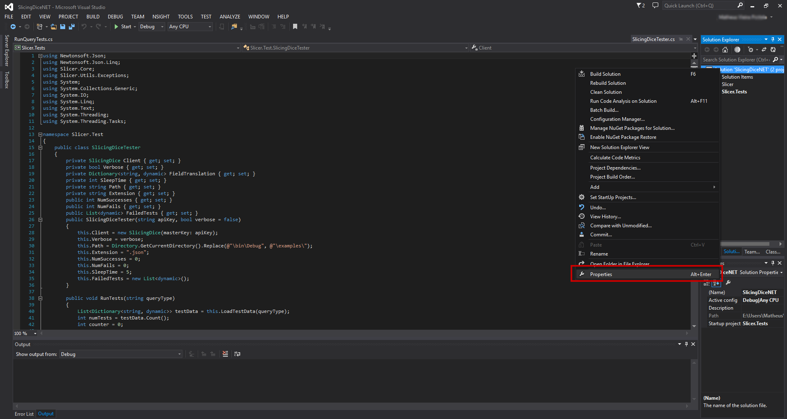
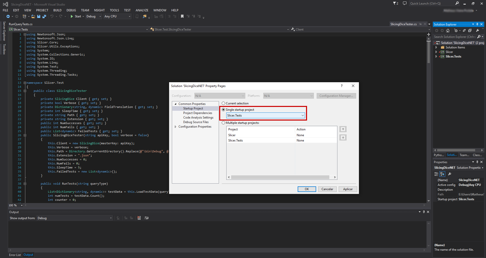
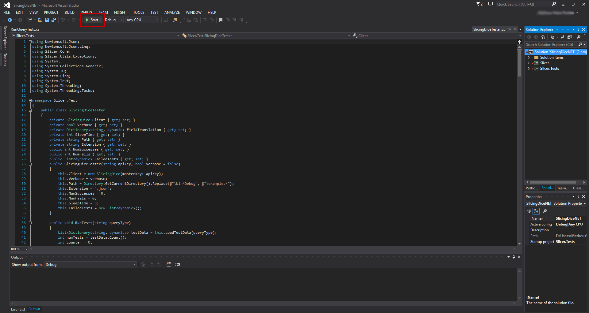

# Tests and Examples

In this directory, you find unitary and regression tests for SlicingDice client. These tests are self-contained and have two purposes:

1. Present examples of field creation, data indexing, and queries, as well as expected query results
2. Provide regression tests that can be executed by anyone with one simple command

## Data
The `examples/` directory contains one file for each [SlicingDice query](http://panel.slicingdice.com/docs/#data-querying) in JSON format.

Each JSON file contains a list of examples, such as the following excerpt, with the following elements:

* `name`: Test name, as it will be printed on screen.
* `fields`: [Fields](http://panel.slicingdice.com/docs/#data-modeling-fields) that will be created for this test.
* `index`: Data that will be [indexed](http://panel.slicingdice.com/docs/#data-indexing) in this test.
* `query`: [Query](http://panel.slicingdice.com/docs/#data-querying) that will extract some information for the indexed data.
* `expected`: Expected result message after SlicingDice executes the query. Values marked as `"ignore"` won't be taken into account to determine whether the test has passed or failed.

```json
[
    {
        "name": "Test for a \"COUNT ENTITY\" query using field \"STRING\" and parameter \"EQUALS\".",
        "description": "Optional description about the test",
        "fields": [
            {
                "name": "string_test_field",
                "api-name": "string-test-field",
                "type": "string",
                "cardinality": "high",
                "storage": "latest-value"
            }
        ],
        "index": {
            "24": {
                "string-test-field": "value:matched_value"
            }
        },
        "query": {
            "query-name": "test_result_query",
            "query": [
                {
                    "string-test-field": {
                        "equals": "value:matched_value"
                    }
                }
            ]
        },
        "expected": {
            "status": "ignore",
            "result": {
                "test_result_query": 1
            },
            "took": "ignore"
        }
    },
    {
        "name": "Test for a \"COUNT ENTITY\" query using field \"INTEGER\" and parameter \"EQUALS\".",
        "description": "Optional description about the test",
        "fields": [
            {
                "name": "integer_test_field",
                "api-name": "integer-test-field",
                "type": "integer",
                "storage": "latest-value"
            }
        ],
        "index": {
            "1": {
                "integer-test-field": 1000001
            },
            "2": {
                "integer-test-field": 1234567
            },
            "3": {
                "integer-test-field": 1000001
            }
        },
        "query": {
            "query-name": "test_result_query",
            "query": [
                {
                    "integer-test-field": {
                        "equals": 1000001
                    }
                }
            ]
        },
        "expected": {
            "status": "ignore",
            "result": {
                "test_result_query": 2
            },
            "took": "ignore"
        }
    }
]
```

## Executing

In order to run all tests stored at `examples/`, simply execute the following steps in your Visual Studio

1. Open Slicer project

2. Right-click the Solution in you Solution Explorer and select "Properties"


3. In "Common Properties > Startup Project", select "Slicer.Tests" in the option "Single startup project" and confirm by click on "OK"


4. Compile and run the project


This will execute the `RunQueryTests.cs` program, where you can see the progress of your tests.

## Output

The test script will execute one test at a time, printing results such as the following:

```
(1/2) Executing test "Test for a "COUNT ENTITY" query using field "STRING" and parameter "EQUALS"."
  Query type: count_entity
  Creating 1 field
  Indexing 1 entity
  Querying
  Status: Passed

(2/2) Executing test "Test for a "COUNT ENTITY" query using field "INTEGER" and parameter "EQUALS"."
  Query type: count_entity
  Creating 1 field
  Indexing 3 entities
  Querying
  Status: Passed

Results:
  Successes: 2
  Fails: 0

SUCCESS: All tests passed
```

In case a test fails, the script will output the expected and actual result messages, continue executing other tests and, at the end, consolidate all failed tests.

```
(1/2) Executing test "Test for a "COUNT ENTITY" query using field "STRING" and parameter "EQUALS"."
  Query type: count_entity
  Creating 1 field
  Indexing 1 entity
  Querying
  Expected: "result": {u'test_result_query': 1}
  Result:   "result": {u'test_result_query': 0}
  Status: Failed

(2/2) Executing test "Test for a "COUNT ENTITY" query using field "INTEGER" and parameter "EQUALS"."
  Query type: count_entity
  Creating 1 field
  Indexing 3 entities
  Querying
  Status: Passed

Results:
  Successes: 1
  Fails: 1
    - Test for a "COUNT ENTITY" query using field "STRING" and parameter "EQUALS".

FAIL: 1 test has failed
```
